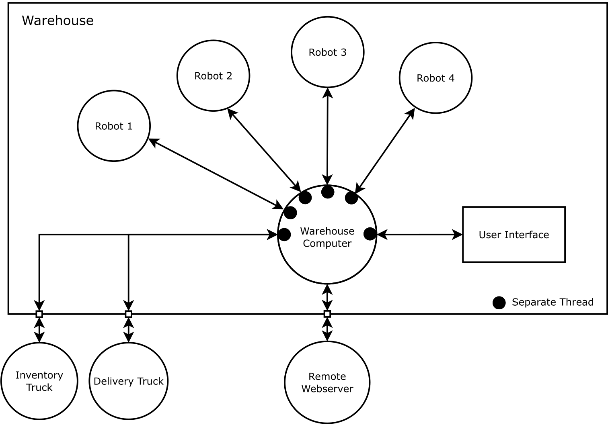
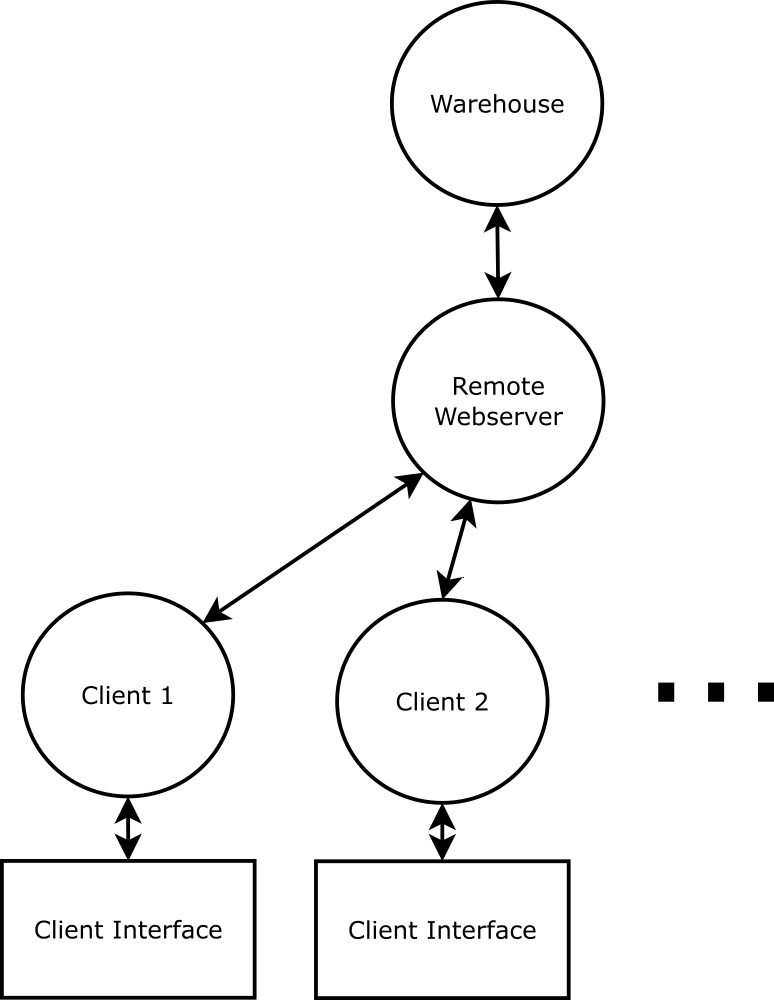
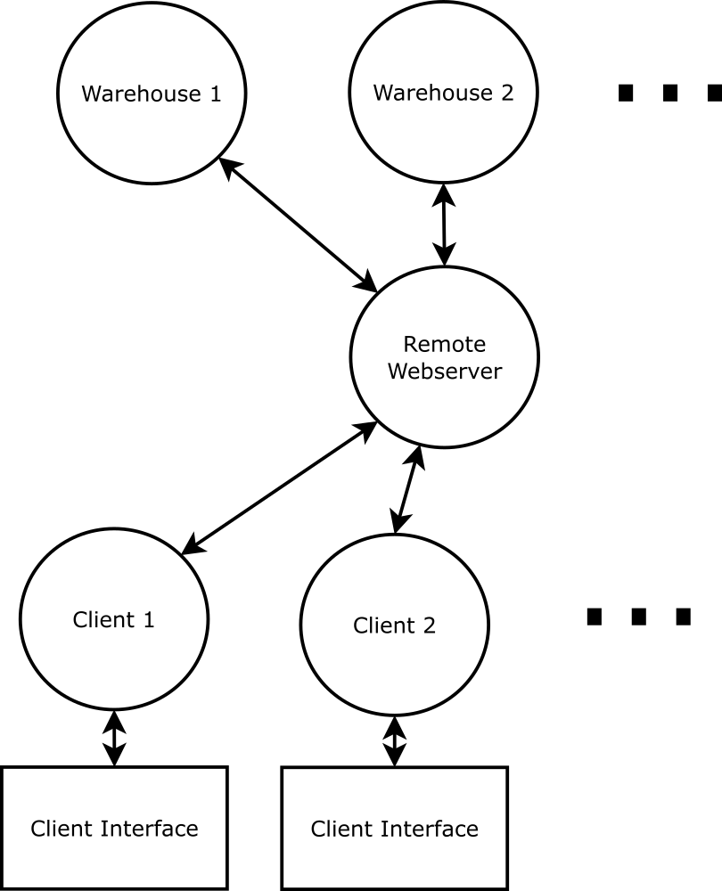

# Amazoom: Automated Warehouse Proposal

For this course project, you will *design* and implement a *real-time simulation* of the system software that runs an automated warehouse.  You are responsible for producing a [design document](https://en.wikipedia.org/wiki/Software_design_description) that describes the system architecture and information flow for your automated warehouse design, as well as a multi-process, multi-threaded simulation of the software to prove to Amazoom that your design is safe, efficient, and will satisfy all their needs.

The project must be done in groups of 3-4.

## Introduction

Amazoom is the largest internet-based retailer in the world, selling and shipping everything from bananas to laptops to engagement rings.  They're currently looking to cut costs by automating all of their warehouses, but they do not have the in-house expertise to design such a thing.  They *just* put out an open call for proposals.

Your engineering firm specializes in designing robots for automation, but you have never tackled such a systems design project before.  However,  you're confident that with your new skills in *System Software Engineering*, you have a shot and winning the multi-billion dollar contract.  Not only do you plan to submit a configurable and scalable design, but you will also *wow* them with a simulation of your system up and running.  This will help prove that you are the right team for the job.

## Warehouse Function

### Layout

Amazoom's warehouses are laid out on a grid, with long aisles of shelving.  Their products are [randomly distributed](https://www.youtube.com/watch?v=5TL80_8ACPc) on the shelves (e.g. pickles can be next to perfume) to allow for faster collection of items when putting together an order.  The warehouse grid and shelves are labelled so that products can be easily located.  For example, a box of Kleenex might be stored at (A, 3, right, 6), which corresponds to column A, row 3, on the right-hand side, and the 6th shelf from the bottom. Each shelving space  -- corresponding to a single coordinate -- has a limited weight capacity for storing items.

The warehouse has a loading bay with a fixed number of docks.  Any dock can be used for either incoming inventory (to restock), or for outgoing deliveries.

### Central Computer

The warehouse has a central computer system that is used to keep track of:
- a database of products and inventory
- the locations of inventory within the warehouse
- a list of orders received, orders ready for delivery, and orders out for delivery
- the arrival/departure of delivery and restocking trucks

When orders are placed, the computer plans the routes to take to collect items.  When restocking, the computer plans the route and locations for new items to be placed.  This makes the process ideal for automation.

Orders come in from a single *remote webserver*.  If the warehouse has all the items requested, it fulfils the order by:
- updating the inventory list to reflect the sale
- inserting the order into a queue to be collected for delivery

All items in the order are collected and brought to the next waiting delivery truck.  Once on the truck, the central warehouse computer is notified that the order is ready for delivery.

The computer also provides a user-interface where the warehouse manager can
- query the status of an order
- check the number in stock of an item
- get alerts about low-stock items

### Delivery and Restocking

A delivery or restocking truck can dock at any available slot in the loading bay.  If no slot is available, the truck waits until one becomes free.

Once docked, a delivery truck notifies the central computer of its arrival, and waits at the dock until it is "full enough" to warrant a delivery.  The truck has a limited cargo weight capacity for holding items.  An order should not be put onto the truck unless the entire order can fit.  Once the truck leaves, it notifies the central computer and the dock becomes available for the next waiting vehicle.

When a truck bringing in new stock docks in the loading bay, it notifies the central computer of its arrival and its contents.  It then remains docked until all items are removed.  Once empty, it notifies the central computer and leaves.

### Automation

Amazoom wants to automate the collecting and loading of orders for delivery, and the restocking of items onto warehouse shelves.

Your engineering firm has already designed the perfect robots for the job.  They can be wirelessly controlled, have advanced object recognition, automated navigation, and collision avoidance capabilities.  They are both extremely strong and dexterous, capable of picking up any item that Amazoom sells.  The robots do have a certain carrying capacity by weight, however, limiting the number of items they can transport at a time.

Your job, as the new system software engineer, is to design and implement the software that runs the entire warehouse operation.  This includes software processes for:
- The central warehouse computer
- The user-interface for the computer
- The automation robots
- The remote webserver that places orders
- Delivery and restocking trucks

## Getting Started

Rather than jumping straight into the design of a full complex system, start with a simpler system and build up as you get things working.  For example, try beginning with only a fixed warehouse layout and a single robot.  Program your robot process to navigate around the warehouse without crossing through shelving units.  Then slowly add the central computer, product database with one or two items, interactions with deliveries, user-interface, remote machine for orders, and so on.

An overview of the system *might* look something like the following:

Any signalling, communication, and synchronization mechanisms are completely up to you.

## Requirements

Your project submission will include a design document and copy of all source code.  You will also need to schedule a demo with the TAs to show off your system's functionality, and to answer any questions about the design and implementation of your work.

### Design Document

The design document should outline everything developers need to know so that someone joining the team can learn all the architectural details and *big-picture* concepts.

At minimum it should include:

- A Use-Case Diagram along with descriptions of use cases and use case scenarios
- A Class Diagram outlining your code structure
- An Object Interaction Diagram to outline how the major components communicate
- Sequence Diagram(s) for any non-trivial interactions
- Descriptions of any communication protocols developed
- Function specifications for any useful "public" functions (i.e. public member functions, re-useable headers, etc...)

You should also prepare an *executive summary* for your firm's project manager to bring to Amazoom.  It should be short enough so nobody will get bored, but informative enough that someone reading it will have a general understanding of the overall system design, as well as why your design stands out over the competition.

### Phase I: Start Simple

Design and implement the automated warehouse system as described above.

- a fixed warehouse layout
- a fixed number of warehouse robots, at least 4
- a fixed number of products, at least 5

### Phase II: Warehouse Layouts, Robot Numbers, and Client Connections
Allow flexibility in the design:
- flexible warehouse layouts (e.g. loaded from a file, prompting admin users for dimensions, etc)
- a dynamic number of robots (i.e. can be added or removed while the system is running)
- multiple clients connections sending orders to the webserver

Clients should be able to connect in an ad-hoc fashion, and each have a UI for placing orders.  If an order cannot be completed due to lack of stock, a simple message back to the client is sufficient.

### Phase III: Network Amongst Warehouses

Include a network of warehouses, and improved client functionality.

The individual warehouses should have some variability in terms of the items they hold. If an order cannot be fulfilled by a single warehouse, it should be split across multiple warehouses if possible.

Clients should have the ability to query how many of an item is in stock, *reserve* an item if in stock (e.g. by adding it to cart), and to place an order.  Once items are reserved, the order should be guaranteed to be deliverable.

## Grading

The grading scheme for this project is split as follows:

| Component       |   Grade             |
|-----------------|---------------------|
| Overall System Design   |   18 %      |
| Requirements Satisfied  |   10 %      |
| Design Document         |   26 %      |
| Functional Implementation  |   26 %   |
| Testing                    |   10 %   |
| Demo                    |   10 %   |
| Extra features          |    15 %     |

All students within a group will be awarded the same mark. The final grade is at the discretion of the TAs and instructor. Phases I, II, III are required to be completed by the team.

## Deadline

The deadline for the project is the day of the last class, **Dec 7th 8am PST via TurnItIn and Git**.  You must demo your project *before* the scheduled exam.  There will be a dedicated time to demo your project. Details of the Demo session and its date will be announced later in November.
